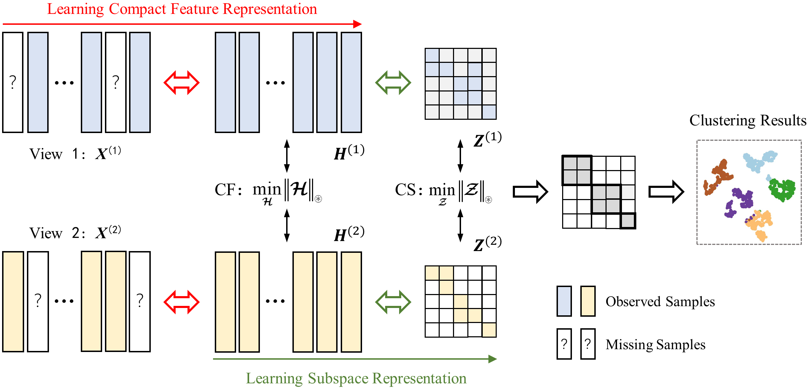

# CUMRL
Source codes of "Twin reciprocal completion for incomplete multi-view clustering" pubilished in IEEE TCSVT 2024

To prepare the incomplete multi-view data, please to "High-order Correlation Preserved Incomplete Multi-view Subspace Clustering (IEEE TIP 2022)", which is a good and inspirational work. The corresponding source codes can be also found in "https://github.com/guanyuezhen/HCP-IMSC"

If you find the codes useful in your research, please cite our work as follows, thanks.

@article\{TRCIMC, 
      &nbsp;&nbsp;&nbsp;&nbsp;title=\{Twin reciprocal completion for incomplete multi-view clustering\}, 
      &nbsp;&nbsp;&nbsp;&nbsp;author=\{Zheng, Qinghai and Tang, Haoyu\}, 
      &nbsp;&nbsp;&nbsp;&nbsp;journal=\{IEEE Transactions on Circuits and Systems for Video Technology\}, 
      &nbsp;&nbsp;&nbsp;&nbsp;year=\{2024\}, 
      &nbsp;&nbsp;&nbsp;&nbsp;doi=\{10.1109/TCSVT.2024.3437756\} 
\} 

Email: zhengqinghai@fzu.edu.cn
